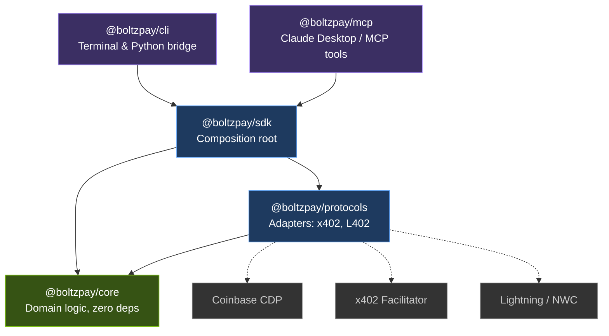

BoltzPay is split into five packages with strict dependency boundaries. Dependencies flow inward: outer packages depend on inner ones, never the reverse. The core domain has zero external dependencies.

## Package Dependency Graph

## Package Responsibilities

### @boltzpay/core (green)

The sovereign domain layer. Contains value objects, domain errors, chain types, and protocol interfaces. **Zero runtime dependencies.** Everything here is pure TypeScript with no imports from external packages.

- `Money` -- immutable value object for amounts (BigInt-based, currency-aware)
- `ProtocolAdapter` -- interface that x402 and L402 adapters implement
- `ChainSelection` -- multi-chain negotiation logic (EVM vs SVM)
- Domain errors -- `NegativeMoneyError`, `NoCompatibleChainError`, etc.

### @boltzpay/protocols (blue)

Protocol adapters that know how to detect, quote, sign, and deliver payments for each supported protocol. Currently ships with:

- **X402Adapter** -- handles x402 V1, V2, and V1-in-V2 hybrid formats. Uses Coinbase CDP for EIP-3009 signing.
- **L402Adapter** -- handles L402 (Lightning). Uses NWC for invoice payment.

Each adapter implements a shared interface: `detect()`, `quote()`, `execute()`.

### @boltzpay/sdk (blue)

The composition root. This is what users import. It wires together core domain logic and protocol adapters into the `BoltzPay` class. Exposes `fetch()`, `quote()`, `discover()`, `getBudget()`, `getHistory()`, `getCapabilities()`, `getWalletStatus()`, and `getBalances()`.

### @boltzpay/cli (purple)

A terminal interface that wraps the SDK. Commands: `check`, `quote`, `fetch`, `discover`, `budget`, `history`, `wallet`, `demo`. Also serves as a bridge for Python agents (LangChain, CrewAI) via subprocess calls.

### @boltzpay/mcp (purple)

An MCP server exposing 7 tools for Claude Desktop and other MCP-compatible clients. Install with `npx @boltzpay/mcp` and point Claude Desktop at it.

## External Systems (gray)

- **Coinbase CDP** -- wallet management and EIP-3009 signing for x402 payments (USDC on Base)
- **x402 Facilitator** -- on-chain payment verification and settlement
- **Lightning / NWC** -- Nostr Wallet Connect for L402 invoice payments

## Design Principles

- **Inward dependencies** -- CLI and MCP depend on SDK. SDK depends on Protocols and Core. Core depends on nothing. No circular dependencies.
- **Protocol-agnostic core** -- `Money`, `Budget`, and `BudgetTracker` know nothing about x402 or L402. Adding a new protocol means adding a new adapter in `packages/protocols`, not touching core.
- **Lazy credentials** -- The SDK accepts wallet credentials optionally. Read-only operations (`quote`, `check`, `discover`) work without any keys. Payment operations validate credentials at call time.

## Next Steps

- [How It Works](/concepts/how-it-works) -- the full payment flow sequence
- [Protocol Detection](/concepts/protocol-detection) -- how adapters identify payment protocols
