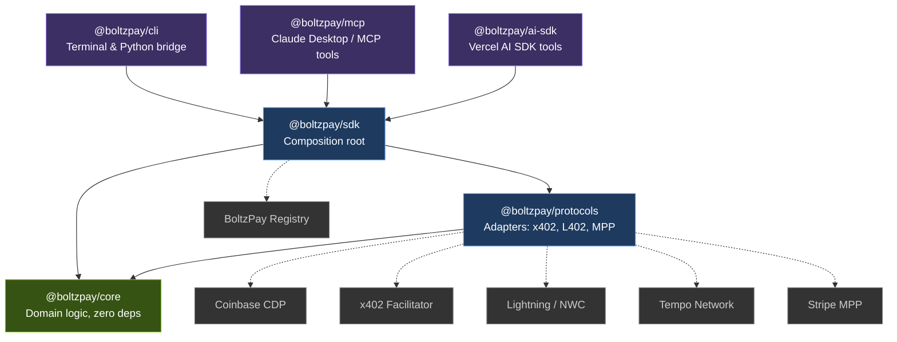

BoltzPay is split into six packages with strict dependency boundaries. Dependencies flow inward: outer packages depend on inner ones, never the reverse. The core domain has zero external dependencies.

## Package Dependency Graph

```mermaid
flowchart TB
    CLI["@boltzpay/cli<br/>Terminal & Python bridge"]
    MCP["@boltzpay/mcp<br/>Claude Desktop / MCP tools"]
    AISDK["@boltzpay/ai-sdk<br/>Vercel AI SDK tools"]
    SDK["@boltzpay/sdk<br/>Composition root"]
    Protocols["@boltzpay/protocols<br/>Adapters: x402, L402, MPP"]
    Core["@boltzpay/core<br/>Domain logic, zero deps"]

    CDP["Coinbase CDP"]
    Facilitator["x402 Facilitator"]
    Lightning["Lightning / NWC"]
    Tempo["Tempo Network"]
    StripeMPP["Stripe MPP"]
    Registry["BoltzPay Registry"]

    CLI --> SDK
    MCP --> SDK
    AISDK --> SDK
    SDK --> Protocols
    SDK --> Core
    SDK -.-> Registry
    Protocols --> Core
    Protocols -.-> CDP
    Protocols -.-> Facilitator
    Protocols -.-> Lightning
    Protocols -.-> Tempo
    Protocols -.-> StripeMPP

    style Core fill:#365314,stroke:#84cc16,color:#fff
    style SDK fill:#1e3a5f,stroke:#60a5fa,color:#fff
    style Protocols fill:#1e3a5f,stroke:#60a5fa,color:#fff
    style CLI fill:#3b2f63,stroke:#a78bfa,color:#fff
    style MCP fill:#3b2f63,stroke:#a78bfa,color:#fff
    style AISDK fill:#3b2f63,stroke:#a78bfa,color:#fff
    style CDP fill:#333,stroke:#888,color:#ccc
    style Facilitator fill:#333,stroke:#888,color:#ccc
    style Lightning fill:#333,stroke:#888,color:#ccc
    style Tempo fill:#333,stroke:#888,color:#ccc
    style StripeMPP fill:#333,stroke:#888,color:#ccc
    style Registry fill:#333,stroke:#888,color:#ccc
```

## Package Responsibilities

### @boltzpay/core (green)

The sovereign domain layer. Contains value objects, domain errors, chain types, and protocol interfaces. **Zero runtime dependencies.** Everything here is pure TypeScript with no imports from external packages.

- `Money` -- immutable value object for amounts (BigInt-based, currency-aware)
- `ProtocolAdapter` -- interface that x402, L402, and MPP adapters implement for one-shot payments
- `SessionAdapter` and `ManagedSession` -- interfaces for session-based payment protocols (payment channels, streaming)
- `ChainSelection` -- multi-chain negotiation logic (EVM vs SVM)
- Domain errors -- `NegativeMoneyError`, `NoCompatibleChainError`, etc.

### @boltzpay/protocols (blue)

Protocol adapters that know how to detect, quote, sign, and deliver payments for each supported protocol. Currently ships with:

- **X402Adapter** -- handles x402 V1, V2, and V1-in-V2 hybrid formats. Uses Coinbase CDP for EIP-3009 signing.
- **L402Adapter** -- handles L402 (Lightning). Uses NWC for invoice payment.
- **MppAdapter** -- handles MPP (Micropayment Protocol). Uses mppx for one-shot charges (Tempo, Stripe) and session-based streaming via payment channels.
- **MppSessionManager** -- implements `SessionAdapter` for persistent payment channel sessions with streaming support.

Each adapter implements a shared interface: `ProtocolAdapter` for one-shot payments (`detect()`, `quote()`, `execute()`), and `SessionAdapter` for session-based protocols alongside it.

### @boltzpay/sdk (blue)

The composition root. This is what users import. It wires together core domain logic and protocol adapters into the `BoltzPay` class. Exposes `fetch()`, `quote()`, `diagnose()`, `discover()`, `openSession()`, `wrapMcpClient()`, `getBudget()`, `getHistory()`, `getCapabilities()`, `getWalletStatus()`, and `getBalances()`. Registry integration via `discover()` queries the live BoltzPay Registry API for endpoint metadata, scores, and protocol information.

### @boltzpay/cli (purple)

A terminal interface that wraps the SDK. Commands: `quote`, `fetch`, `discover`, `diagnose`, `budget`, `history`, `wallet`, `demo`. The `discover` command supports `--protocol`, `--min-score`, and `--query` flags for filtered searches. Also serves as a bridge for Python agents (LangChain, CrewAI) via subprocess calls.

### @boltzpay/mcp (purple)

An MCP server exposing 7 tools for Claude Desktop and other MCP-compatible clients. Install with `npx @boltzpay/mcp` and point Claude Desktop at it. The discover tool supports `protocol`, `minScore`, and `query` filters.

### @boltzpay/ai-sdk (purple)

A Vercel AI SDK integration exposing 7 tools via `boltzpayTools()`. Use with `generateText()` or `streamText()` from the Vercel AI SDK.

## External Systems (gray)

- **Coinbase CDP** -- wallet management and EIP-3009 signing for x402 payments (USDC on Base)
- **x402 Facilitator** -- on-chain payment verification and settlement
- **Lightning / NWC** -- Nostr Wallet Connect for L402 invoice payments
- **Tempo Network** -- payment channel network for MPP streaming sessions
- **Stripe MPP** -- Stripe integration for MPP one-shot payments
- **BoltzPay Registry** -- live API endpoint registry at status.boltzpay.ai (scores, health, protocol metadata)

## Design Principles

- **Inward dependencies** -- CLI, MCP, and AI-SDK depend on SDK. SDK depends on Protocols and Core. Core depends on nothing. No circular dependencies.
- **Protocol-agnostic core** -- `Money`, `Budget`, and `BudgetTracker` know nothing about x402, L402, or MPP. Adding a new protocol means adding a new adapter in `packages/protocols`, not touching core.
- **Session vs one-shot** -- `ProtocolAdapter` handles stateless one-shot payments. `SessionAdapter` handles stateful payment channel sessions. Both live in `packages/protocols`, share the same core types.
- **Registry as single source** -- `discover()` queries the live registry API. No static directory bundled with the SDK.
- **Lazy credentials** -- The SDK accepts wallet credentials optionally. Read-only operations (`quote`, `discover`, `diagnose`) work without any keys. Payment operations validate credentials at call time.

## Next Steps

- [How It Works](/concepts/how-it-works) -- the full payment flow sequence
- [Protocol Detection](/concepts/protocol-detection) -- how adapters identify payment protocols
