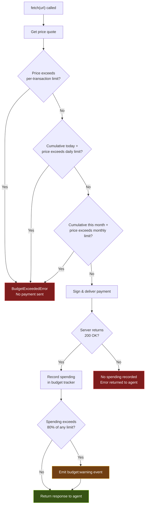

AI agents should never have unlimited spending power. BoltzPay enforces budget limits **before** any payment is signed or sent. If a request would exceed your limits, it fails immediately with a clear error. No money leaves your wallet.

## Budget Check Flow



## Safety Guarantees

### Budget checks happen before payment

The SDK validates all three limits (per-transaction, daily, monthly) **before** signing. If any limit is exceeded, a `BudgetExceededError` is thrown and the payment flow stops. Your wallet is never touched.

### Spending is only recorded on success

If the payment fails or the server returns an error after payment, the amount is **not** recorded against your budget. This prevents phantom spending from eating into your limits.

### Warning events at 80%

When cumulative spending crosses 80% of any configured limit, the SDK emits a `budget:warning` event. You can listen for these to alert your agent or operator before hitting a hard stop.

## Configuration

Set budget limits in the constructor:

```typescript
const agent = new BoltzPay({
  coinbaseApiKeyId: process.env.COINBASE_API_KEY_ID!,
  coinbaseApiKeySecret: process.env.COINBASE_API_KEY_SECRET!,
  coinbaseWalletSecret: process.env.COINBASE_WALLET_SECRET!,
  budget: {
    perTransaction: "1.00",  // Max $1 per request
    daily: "10.00",          // Max $10 per day
    monthly: "100.00",       // Max $100 per month
  },
});
```

All values are in USD. L402 payments in satoshis are converted to USD via `satToUsdRate` (default: 0.001, ~$100K/BTC) and count toward the same limits. If you omit a limit, that check is skipped (no limit enforced for that tier).

## Checking Remaining Budget

```typescript
const budget = agent.getBudget();

console.log("Per-tx limit:", budget.perTransaction?.toDisplayString());
console.log("Daily spent:", budget.dailySpent?.toDisplayString());
console.log("Daily remaining:", budget.dailyRemaining?.toDisplayString());
console.log("Monthly spent:", budget.monthlySpent?.toDisplayString());
console.log("Monthly remaining:", budget.monthlyRemaining?.toDisplayString());
```

## Listening for Warnings

```typescript
agent.on("budget:warning", (event) => {
  console.warn(
    `Budget warning: ${event.period} limit ${Math.round(event.usage * 100)}% used`
  );
});
```

## What Happens Without a Budget

If you create a `BoltzPay` instance without a `budget` config, **no spending limits are enforced**. Every payment that the server requests will be signed and sent. This is fine for testing but not recommended for production agents.

<Warning>
  Always configure budget limits for autonomous agents. An agent in a loop with no budget can drain a wallet in minutes.
</Warning>

## Next Steps

- [How It Works](/concepts/how-it-works) -- the full payment flow, including where budget checks fit in
- [Configuration](/getting-started/configuration) -- all constructor options and environment variables
