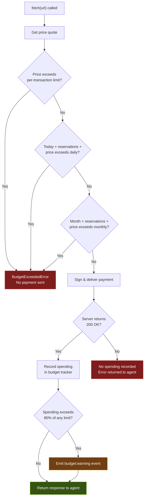

AI agents should never have unlimited spending power. BoltzPay enforces budget limits **before** any payment is signed or sent. If a request would exceed your limits, it fails immediately with a clear error. No money leaves your wallet.

## Budget Check Flow


```mermaid
flowchart TD
    Start["fetch(url) called"] --> Quote["Get price quote"]
    Quote --> PerTx{"Price exceeds<br/>per-transaction limit?"}

    PerTx -- Yes --> Reject["BudgetExceededError<br/>No payment sent"]
    PerTx -- No --> Daily{"Today + reservations +<br/>price exceeds daily?"}

    Daily -- Yes --> Reject
    Daily -- No --> Monthly{"Month + reservations +<br/>price exceeds monthly?"}

    Monthly -- Yes --> Reject
    Monthly -- No --> Pay["Sign & deliver payment"]

    Pay --> Success{"Server returns<br/>200 OK?"}
    Success -- Yes --> Record["Record spending<br/>in budget tracker"]
    Success -- No --> NoRecord["No spending recorded<br/>Error returned to agent"]

    Record --> Warn{"Spending exceeds<br/>80% of any limit?"}
    Warn -- Yes --> Event["Emit budget:warning event"]
    Warn -- No --> Done["Return response to agent"]
    Event --> Done

    style Reject fill:#7f1d1d,stroke:#f87171,color:#fff
    style NoRecord fill:#7f1d1d,stroke:#f87171,color:#fff
    style Done fill:#365314,stroke:#84cc16,color:#fff
    style Event fill:#713f12,stroke:#fbbf24,color:#fff
```

## Safety Guarantees

### Budget checks happen before payment

The SDK validates all three limits (per-transaction, daily, monthly) **before** signing. If any limit is exceeded, a `BudgetExceededError` is thrown and the payment flow stops. Your wallet is never touched.

### Spending is only recorded on success

If the payment fails or the server returns an error after payment, the amount is **not** recorded against your budget. This prevents phantom spending from eating into your limits.

### Warning events at 80%

When cumulative spending crosses 80% of any configured limit, the SDK emits a `budget:warning` event. You can listen for these to alert your agent or operator before hitting a hard stop.

## Session Budget (Reserve / Release)

Sessions use a reservation pattern to prevent budget overcommitment when multiple sessions run concurrently.

### How it works

1. **Reserve** -- When `openSession()` is called, the SDK reserves the deposit amount from the available budget. This atomically decrements available capacity.
2. **Per-voucher check** -- During streaming, each voucher's cumulative amount is checked against the reserved deposit. If it exceeds the deposit, the session is force-closed and a `MppSessionBudgetError` is thrown.
3. **Release** -- When `session.close()` is called, unused deposit (deposit minus actual spent) is released back to the budget.

```typescript
// Budget: $10 daily, $5 spent already
// Available for reservation: $5

const session1 = await agent.openSession(url, { maxDeposit: "3.00" });
// Reserved: $3, available: $2

const session2 = await agent.openSession(url, { maxDeposit: "2.00" });
// Reserved: $2, available: $0

// session2 spends $0.50, then closes
const receipt = await session2.close();
// Released: $1.50 unused, available: $1.50

// session1 is still open, budget correctly reflects both
```

### Orphan detection

Sessions write two history entries: one at `open` (with `sessionStatus: "open"`) and one at `close` (with `sessionStatus: "closed"`). If a session opens but never closes (crash, timeout), the open entry without a matching close entry is detectable in payment history.

## MCP Budget Enforcement

When using `wrapMcpClient()`, the SDK intercepts payment challenges before credential creation. The challenge includes an `amount` field — the SDK converts it to USD and runs the standard budget check (per-transaction, daily, monthly) before allowing the credential to be created.

If the budget check fails, a `BudgetExceededError` is thrown and the MCP call returns an error. No payment is made.

```typescript
const wrapped = agent.wrapMcpClient(mcpClient);

// Budget check happens automatically before payment
try {
  await wrapped.callTool({ name: "expensive_tool" });
} catch (err) {
  if (err instanceof BudgetExceededError) {
    console.log("MCP payment blocked by budget");
  }
}
```

## Configuration

Set budget limits in the constructor:

```typescript
const agent = new BoltzPay({
  coinbaseApiKeyId: process.env.COINBASE_API_KEY_ID!,
  coinbaseApiKeySecret: process.env.COINBASE_API_KEY_SECRET!,
  coinbaseWalletSecret: process.env.COINBASE_WALLET_SECRET!,
  budget: {
    perTransaction: "1.00",  // Max $1 per request
    daily: "10.00",          // Max $10 per day
    monthly: "100.00",       // Max $100 per month
  },
});
```

All values are in USD. L402 payments in satoshis are converted to USD via `satToUsdRate` (default: 0.001, ~$100K/BTC) and count toward the same limits. If you omit a limit, that check is skipped (no limit enforced for that tier).

## Checking Remaining Budget

```typescript
const budget = agent.getBudget();

console.log("Per-tx limit:", budget.perTransaction?.toDisplayString());
console.log("Daily spent:", budget.dailySpent?.toDisplayString());
console.log("Daily remaining:", budget.dailyRemaining?.toDisplayString());
console.log("Monthly spent:", budget.monthlySpent?.toDisplayString());
console.log("Monthly remaining:", budget.monthlyRemaining?.toDisplayString());
```

## Listening for Warnings

```typescript
agent.on("budget:warning", (event) => {
  console.warn(
    `Budget warning: ${event.period} limit ${Math.round(event.usage * 100)}% used`
  );
});
```

## What Happens Without a Budget

If you create a `BoltzPay` instance without a `budget` config, **no spending limits are enforced**. Every payment that the server requests will be signed and sent. This is fine for testing but not recommended for production agents.

<Warning>
  Always configure budget limits for autonomous agents. An agent in a loop with no budget can drain a wallet in minutes.
</Warning>

## Next Steps

- [How It Works](/concepts/how-it-works) -- the full payment flow, including where budget checks fit in
- [Sessions](/concepts/sessions) -- reservation lifecycle, streaming vouchers, and session receipts
- [Configuration](/getting-started/configuration) -- all constructor options and environment variables
