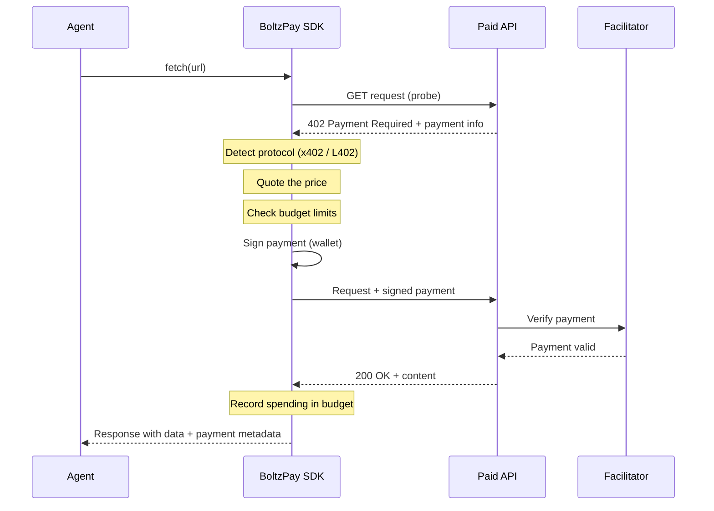

BoltzPay turns a single `fetch()` call into a complete payment flow. Your agent never touches wallets, protocols, or transaction signing directly. The SDK handles everything behind the scenes.

## The Payment Flow

When your agent calls `agent.fetch(url)`, here is what happens under the hood:



## Step by Step

1. **Probe** -- The SDK sends a regular GET request to the endpoint. If the server returns `200`, the response passes through as-is. No payment needed.

2. **402 Detection** -- If the server returns `402 Payment Required`, the SDK inspects the response headers and body to determine which payment protocol is in use (x402, L402, or a hybrid format).

3. **Quote** -- The SDK extracts the price, currency, network, and facilitator address from the 402 response. This is the same information you get from `agent.quote(url)`.

4. **Budget Check** -- Before any money moves, the SDK validates the price against your configured budget limits (per-transaction, daily, monthly). If the price exceeds any limit, a `BudgetExceededError` is thrown and no payment is made.

5. **Sign** -- The SDK creates a cryptographic payment authorization using your wallet credentials. For x402, this is an EIP-3009 signature (gasless for you). For L402, this is a Lightning invoice payment.

6. **Deliver** -- The SDK re-sends the original request with the signed payment attached (in headers for x402, in a macaroon for L402).

7. **Verify & Settle** -- The server forwards the payment to a facilitator (e.g., Coinbase or x402.org) for on-chain verification and settlement. Once confirmed, the server returns the content.

8. **Record** -- The SDK logs the payment amount in its budget tracker and returns the response to your agent, including payment metadata (`response.payment`).

## What the Agent Sees

From your agent's perspective, nothing unusual happens. It called `fetch()` and got data back:

```typescript
const response = await agent.fetch("https://invy.bot/api");
const data = await response.json();

// Payment details are available if you want them
if (response.payment) {
  console.log(response.payment.amount.toDisplayString()); // "$0.05"
  console.log(response.payment.protocol);                  // "x402"
}
```

Free endpoints work identically. The SDK probes, sees a `200`, and returns the response. `response.payment` is `null`.

## Next Steps

- [Architecture](/concepts/architecture) -- how the SDK packages fit together
- [Protocol Detection](/concepts/protocol-detection) -- the cascade that identifies x402, L402, and hybrid formats
- [Budget & Safety](/concepts/budget-safety) -- spending limits and safety guarantees
