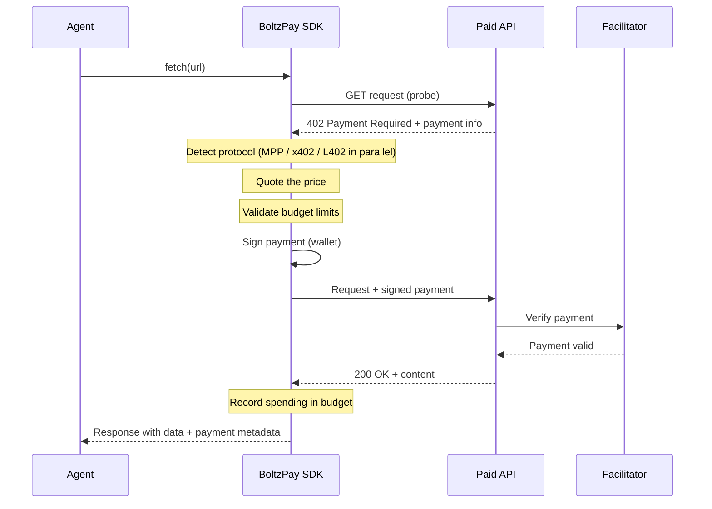
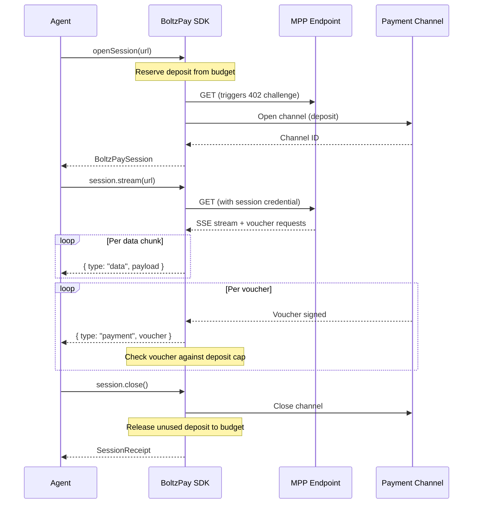

BoltzPay turns a single `fetch()` call into a complete payment flow across x402, L402, and MPP protocols. Your agent never touches wallets, protocols, or transaction signing directly. The SDK handles everything behind the scenes.

## The Payment Flow

When your agent calls `agent.fetch(url)`, here is what happens under the hood:


```mermaid
sequenceDiagram
    participant Agent
    participant SDK as BoltzPay SDK
    participant Server as Paid API
    participant Facilitator

    Agent->>SDK: fetch(url)
    SDK->>Server: GET request (probe)
    Server-->>SDK: 402 Payment Required + payment info

    Note over SDK: Detect protocol (MPP / x402 / L402 in parallel)
    Note over SDK: Quote the price
    Note over SDK: Validate budget limits

    SDK->>SDK: Sign payment (wallet)
    SDK->>Server: Request + signed payment
    Server->>Facilitator: Verify payment
    Facilitator-->>Server: Payment valid
    Server-->>SDK: 200 OK + content

    Note over SDK: Record spending in budget

    SDK-->>Agent: Response with data + payment metadata
```

## Step by Step

1. **Probe** -- The SDK sends a regular GET request to the endpoint. If the server returns `200`, the response passes through as-is. No payment needed.

2. **402 Detection** -- If the server returns `402 Payment Required`, the SDK runs MppAdapter, X402Adapter, and L402Adapter in parallel (`Promise.allSettled`) to determine which payment protocol is in use.

3. **Quote** -- The SDK extracts the price, currency, network, and facilitator address from the 402 response. This is the same information you get from `agent.quote(url)`.

4. **Budget Validation** -- Before any money moves, the SDK validates the price against your configured budget limits (per-transaction, daily, monthly). If the price exceeds any limit, a `BudgetExceededError` is thrown and no payment is made.

5. **Sign** -- The SDK creates a cryptographic payment authorization using your wallet credentials. For x402, this is an EIP-3009 signature (gasless for you). For L402, this is a Lightning invoice payment.

6. **Deliver** -- The SDK re-sends the original request with the signed payment attached (in headers for x402, in a macaroon for L402).

7. **Verify & Settle** -- The server verifies the payment cryptographically (EIP-712 signature for x402, macaroon validation for L402) and settles it on-chain or via Lightning. Once confirmed, the server returns the content.

8. **Record** -- The SDK logs the payment amount in its budget tracker and returns the response to your agent, including payment metadata (`response.payment`).

## What the Agent Sees

From your agent's perspective, nothing unusual happens. It called `fetch()` and got data back:

```typescript
const response = await agent.fetch("https://invy.bot/api");
const data = await response.json();

// Payment details are available if you want them
if (response.payment) {
  console.log(response.payment.amount.toDisplayString()); // "$0.05"
  console.log(response.payment.protocol);                  // "x402"
}
```

Free endpoints work identically. The SDK probes, sees a `200`, and returns the response. `response.payment` is `null`.

## Session Flow

For MPP endpoints that support streaming, use `openSession()` instead of `fetch()`. Sessions open a payment channel with a capped deposit, then let you make multiple requests and stream data with per-voucher micropayments.


```mermaid
sequenceDiagram
    participant Agent
    participant SDK as BoltzPay SDK
    participant Server as MPP Endpoint
    participant Channel as Payment Channel

    Agent->>SDK: openSession(url)
    Note over SDK: Reserve deposit from budget
    SDK->>Server: GET (triggers 402 challenge)
    SDK->>Channel: Open channel (deposit)
    Channel-->>SDK: Channel ID
    SDK-->>Agent: BoltzPaySession

    Agent->>SDK: session.stream(url)
    SDK->>Server: GET (with session credential)
    Server-->>SDK: SSE stream + voucher requests

    loop Per data chunk
        SDK-->>Agent: { type: "data", payload }
    end
    loop Per voucher
        Channel-->>SDK: Voucher signed
        SDK-->>Agent: { type: "payment", voucher }
        Note over SDK: Check voucher against deposit cap
    end

    Agent->>SDK: session.close()
    SDK->>Channel: Close channel
    Note over SDK: Release unused deposit to budget
    SDK-->>Agent: SessionReceipt
```

### Code Example

```typescript
const session = await agent.openSession("https://api.example.com/stream", {
  maxDeposit: "2.00",
});

// Stream data with automatic micropayments
for await (const event of session.stream("https://api.example.com/stream")) {
  if (event.type === "data") {
    console.log("Data:", event.payload);
  } else {
    console.log(`Voucher #${event.voucher.index}: ${event.voucher.cumulativeAmount}`);
  }
}

const receipt = await session.close();
console.log(`Total spent: ${receipt.totalSpent}, refunded: ${receipt.refunded}`);
```

## MCP Transport

For AI agents that call third-party MCP servers requiring payment (error code `-32042`), use `wrapMcpClient()`. The wrapper intercepts payment challenges, checks budget, creates credentials, and retries the call automatically.

```typescript
import { Client } from "@modelcontextprotocol/sdk/client/index.js";

const mcpClient = new Client({ name: "my-agent", version: "1.0" });
// ... connect to MCP server ...

const wrapped = agent.wrapMcpClient(mcpClient);

// Calls that require payment are handled transparently
const result = await wrapped.callTool({ name: "expensive_tool", arguments: { query: "data" } });
console.log(result.content);

if (result.receipt) {
  console.log(`Paid: ${result.receipt.method}:${result.receipt.reference}`);
}
```

## Next Steps

- [Architecture](/concepts/architecture) -- how the SDK packages fit together
- [Protocol Detection](/concepts/protocol-detection) -- how adapters identify x402, L402, and hybrid formats in parallel
- [Budget & Safety](/concepts/budget-safety) -- spending limits and safety guarantees
- [Sessions](/concepts/sessions) -- payment channels and streaming micropayments
- [MCP Transport](/guides/mcp-transport) -- transparent payments for MCP tool calls
