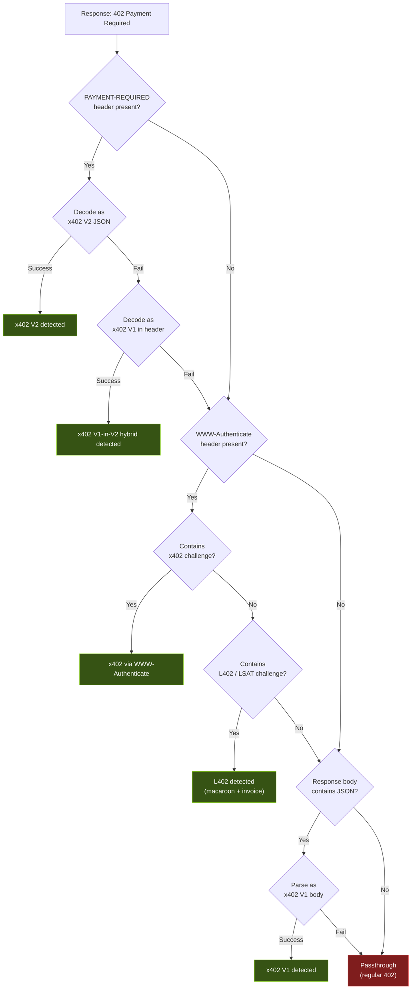

When a server returns `402 Payment Required`, it can encode payment information in several different ways. BoltzPay runs a detection cascade that tries each format in order, handling edge cases like hybrid encodings that mix protocol versions.

## Detection Cascade



## How It Works

The SDK checks locations in this priority order:

### 1. PAYMENT-REQUIRED Header (x402)

The `PAYMENT-REQUIRED` header is the standard location for x402 payment information. The SDK first tries to decode it as **V2 JSON** (the current spec). If that fails, it tries **V1 format** -- some servers send V1-encoded data inside the V2 header. This V1-in-V2 hybrid is rare but exists in the wild (e.g., emc2ai).

```
PAYMENT-REQUIRED: {"x402Version":2,"accepts":[...]}   --> V2
PAYMENT-REQUIRED: {"x402Version":1,"payload":"..."}    --> V1-in-V2 hybrid
```

### 2. WWW-Authenticate Header

If no `PAYMENT-REQUIRED` header is found, the SDK checks `WWW-Authenticate`. This header can carry either:

- An **x402 challenge** with amount and facilitator info
- An **L402 / LSAT challenge** with a macaroon and Lightning invoice

```
WWW-Authenticate: x402 amount="50000" ...              --> x402
WWW-Authenticate: L402 macaroon="..." invoice="lnbc.." --> L402
```

### 3. Response Body (x402 V1)

As a final fallback, the SDK reads the response body and attempts to parse it as x402 V1 JSON. Some early x402 implementations put the entire payment payload in the body rather than headers.

```json
{ "x402Version": 1, "payload": "...", "facilitator": "..." }
```

### 4. Passthrough

If none of the above match, the SDK treats the response as a regular HTTP 402. No payment is attempted, and the original response is returned to the caller. This lets your agent handle non-standard 402 responses with its own logic.

## Supported Formats

| Format | Location | Example Server |
|--------|----------|----------------|
| x402 V2 | `PAYMENT-REQUIRED` header | invy.bot, polymarket |
| x402 V1-in-V2 | `PAYMENT-REQUIRED` header (V1 payload inside) | emc2ai |
| x402 via WWW-Auth | `WWW-Authenticate` header | 402payment-test |
| x402 V1 body | Response body JSON | nickeljoke (testnet) |
| L402 | `WWW-Authenticate` header | satring.com |

## Why a Cascade?

The x402 ecosystem is young. Servers implement different spec versions and sometimes mix formats. By trying multiple detection strategies in order, BoltzPay maximizes compatibility without requiring any configuration from the user. Your agent calls `fetch()` and the SDK figures out the rest.

## Next Steps

- [How It Works](/concepts/how-it-works) -- the full payment flow from probe to response
- [Budget & Safety](/concepts/budget-safety) -- what happens after detection, before payment
