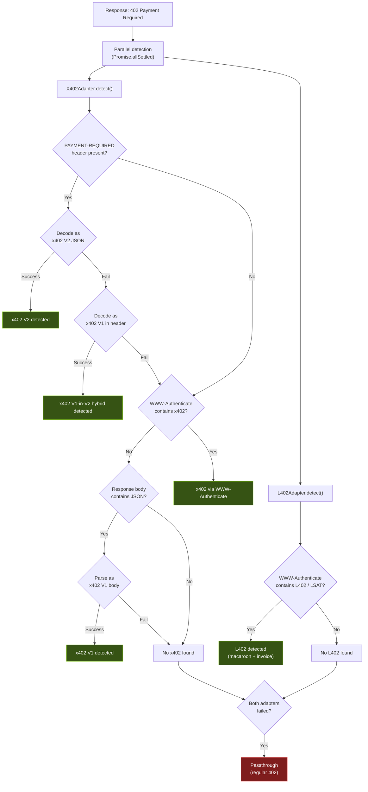

When a server returns `402 Payment Required`, it can encode payment information in several different ways. BoltzPay runs two protocol adapters **in parallel** (`Promise.allSettled`): X402Adapter and L402Adapter. Each adapter has its own detection logic, and the first successful match is used.

## Parallel Detection


```mermaid
flowchart TD
    Start["Response: 402 Payment Required"] --> Par["Parallel detection<br/>(Promise.allSettled)"]

    Par --> X402["X402Adapter.detect()"]
    Par --> L402A["L402Adapter.detect()"]

    X402 --> H1{"PAYMENT-REQUIRED<br/>header present?"}

    H1 -- Yes --> V2{"Decode as<br/>x402 V2 JSON"}
    V2 -- Success --> Done["x402 V2 detected"]
    V2 -- Fail --> V1H{"Decode as<br/>x402 V1 in header"}
    V1H -- Success --> Hybrid["x402 V1-in-V2 hybrid detected"]
    V1H -- Fail --> WWW

    H1 -- No --> WWW{"WWW-Authenticate<br/>contains x402?"}
    WWW -- Yes --> WWWx402["x402 via WWW-Authenticate"]
    WWW -- No --> Body{"Response body<br/>contains JSON?"}

    Body -- Yes --> V1B{"Parse as<br/>x402 V1 body"}
    V1B -- Success --> V1["x402 V1 detected"]
    V1B -- Fail --> X402Fail["No x402 found"]

    Body -- No --> X402Fail

    L402A --> L402WWW{"WWW-Authenticate<br/>contains L402 / LSAT?"}
    L402WWW -- Yes --> L402Done["L402 detected<br/>(macaroon + invoice)"]
    L402WWW -- No --> L402Fail["No L402 found"]

    X402Fail --> Pass
    L402Fail --> Pass
    Pass{"Both adapters<br/>failed?"}
    Pass -- Yes --> Passthrough["Passthrough<br/>(regular 402)"]

    style Done fill:#365314,stroke:#84cc16,color:#fff
    style Hybrid fill:#365314,stroke:#84cc16,color:#fff
    style WWWx402 fill:#365314,stroke:#84cc16,color:#fff
    style L402Done fill:#365314,stroke:#84cc16,color:#fff
    style V1 fill:#365314,stroke:#84cc16,color:#fff
    style Passthrough fill:#7f1d1d,stroke:#f87171,color:#fff
```

## How It Works

The SDK launches both adapters in parallel via `Promise.allSettled()` in the protocol router. Each adapter independently probes the URL, inspects the 402 response, and reports whether it can handle it.

### X402Adapter Detection

The X402Adapter checks three locations in cascade:

**1. PAYMENT-REQUIRED Header** -- The standard location for x402 payment data. The adapter first tries to decode it as **V2 JSON** (the current spec). If that fails, it tries **V1 format** -- some servers send V1-encoded data inside the V2 header. This V1-in-V2 hybrid is rare but exists in the wild (e.g., emc2ai).

```
PAYMENT-REQUIRED: {"x402Version":2,"accepts":[...]}   --> V2
PAYMENT-REQUIRED: {"x402Version":1,"payload":"..."}    --> V1-in-V2 hybrid
```

**2. WWW-Authenticate Header (x402 only)** -- If no `PAYMENT-REQUIRED` header is found, the adapter checks `WWW-Authenticate` for an x402 challenge. It only matches the `x402` scheme and ignores L402/LSAT challenges.

```
WWW-Authenticate: x402 amount="50000" ...              --> x402
```

**3. Response Body (x402 V1)** -- As a final fallback, the adapter reads the response body and attempts to parse it as x402 V1 JSON.

```json
{ "x402Version": 1, "payload": "...", "facilitator": "..." }
```

### L402Adapter Detection

The L402Adapter checks `WWW-Authenticate` for an `L402` or `LSAT` challenge with a macaroon and Lightning invoice. It is a separate adapter that runs independently from X402.

```
WWW-Authenticate: L402 macaroon="..." invoice="lnbc.." --> L402
WWW-Authenticate: LSAT macaroon="..." invoice="lnbc.." --> LSAT (legacy)
```

### Passthrough

If neither adapter detects a supported protocol, the SDK treats the response as a regular HTTP 402. No payment is attempted, and the original response is returned to the caller.

## Supported Formats

| Format | Adapter | Location | Example Server |
|--------|---------|----------|----------------|
| x402 V2 | X402Adapter | `PAYMENT-REQUIRED` header | invy.bot, polymarket |
| x402 V1-in-V2 | X402Adapter | `PAYMENT-REQUIRED` header (V1 payload inside) | emc2ai |
| x402 via WWW-Auth | X402Adapter | `WWW-Authenticate` header | 402payment-test |
| x402 V1 body | X402Adapter | Response body JSON | nickeljoke (testnet) |
| L402 / LSAT | L402Adapter | `WWW-Authenticate` header | satsapi.dev |

## Why Parallel?

The x402 ecosystem is young. Servers implement different spec versions and sometimes mix formats. By running both adapters in parallel, BoltzPay maximizes compatibility and speed without requiring any configuration from the user. Your agent calls `fetch()` and the SDK figures out the rest.

## Next Steps

- [How It Works](/concepts/how-it-works) -- the full payment flow from probe to response
- [Budget & Safety](/concepts/budget-safety) -- what happens after detection, before payment
