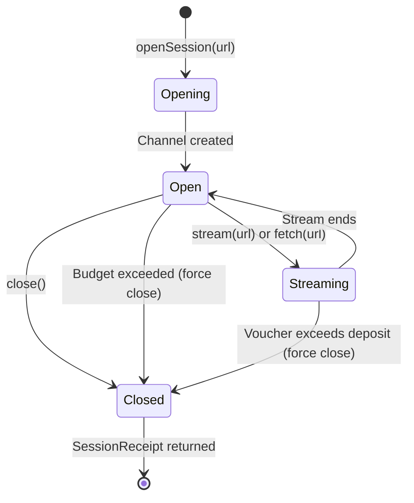

Sessions let you open a persistent payment channel to an MPP endpoint, make multiple requests, and stream data with per-voucher micropayments. Unlike `fetch()` which pays per-request, sessions pay incrementally through vouchers on an open channel.

## When to Use Sessions

| Use case | Method |
|----------|--------|
| Single request, get data, done | `agent.fetch(url)` |
| Multiple requests to same endpoint | `agent.openSession(url)` |
| SSE streaming with micropayments | `session.stream(url)` |
| MCP tool calls with payment | `agent.wrapMcpClient(client)` |

## Lifecycle



## Usage

### Open a session

```typescript
const session = await agent.openSession("https://api.example.com/stream", {
  maxDeposit: "2.00",  // Cap deposit at $2 (optional)
});
```

The SDK:
1. Finds a configured Tempo wallet
2. Computes the deposit: `min(available budget, sessionMaxDeposit config, user maxDeposit)`
3. Reserves the deposit from the budget
4. Opens a payment channel via mppx

### Make requests

Use `session.fetch()` for individual requests within the session:

```typescript
const response = await session.fetch("https://api.example.com/data");
const data = await response.json();
```

### Stream data

Use `session.stream()` for SSE streaming with automatic voucher handling:

```typescript
for await (const event of session.stream("https://api.example.com/stream")) {
  if (event.type === "data") {
    process.stdout.write(event.payload);
  } else if (event.type === "payment") {
    console.log(`Voucher #${event.voucher.index}: cumulative ${event.voucher.cumulativeAmount}`);
  }
}
```

`SessionEvent` is a discriminated union:

```typescript
type SessionEvent =
  | { type: "data"; payload: string }
  | { type: "payment"; voucher: VoucherInfo };

interface VoucherInfo {
  channelId: string;
  cumulativeAmount: bigint;  // Raw USDC atomic units
  index: number;
}
```

### Close the session

```typescript
const receipt = await session.close();
console.log(`Channel: ${receipt.channelId}`);
console.log(`Total spent: ${receipt.totalSpent}`);
console.log(`Refunded: ${receipt.refunded}`);
console.log(`Vouchers: ${receipt.voucherCount}`);
```

`SessionReceipt`:

```typescript
interface SessionReceipt {
  channelId: string;
  totalSpent: bigint;
  refunded: bigint;
  voucherCount: number;
}
```

Closing releases unused deposit back to the budget.

## Budget Enforcement

Sessions enforce budget at two points:

1. **At open** -- The deposit is reserved atomically from available budget. If insufficient budget remains, `openSession()` throws.

2. **Per voucher** -- Each voucher's cumulative amount is checked against the reserved deposit. If cumulative spend exceeds the deposit, the session is force-closed and a `MppSessionBudgetError` is thrown.

```typescript
const agent = new BoltzPay({
  wallets: [{ type: "tempo", name: "main", tempoPrivateKey: "0x..." }],
  budget: { daily: "10.00" },
  sessionMaxDeposit: "3.00",  // Never deposit more than $3 per session
});

// Deposit = min($10 available, $3 config, $2 user) = $2
const session = await agent.openSession(url, { maxDeposit: "2.00" });
```

See [Budget & Safety](/concepts/budget-safety#session-budget-reserve--release) for the full reservation/release pattern.

## Events

Sessions emit four event types:

```typescript
agent.on("session:open", (e) => {
  console.log(`Opened: ${e.channelId}, deposit: ${e.depositAmount.toDisplayString()}`);
});

agent.on("session:voucher", (e) => {
  console.log(`Voucher: channel ${e.channelId}, cumulative ${e.cumulativeAmount}`);
});

agent.on("session:close", (e) => {
  console.log(`Closed: spent ${e.totalSpent}, refunded ${e.refunded}`);
});

agent.on("session:error", (e) => {
  console.error(`Error: ${e.error.message}`);
});
```

## Requirements

- A **Tempo wallet** must be configured (sessions use Tempo payment channels)
- Budget must have sufficient capacity for the deposit
- The endpoint must support MPP session protocol

```typescript
const agent = new BoltzPay({
  wallets: [{
    type: "tempo",
    name: "main",
    tempoPrivateKey: process.env.TEMPO_PRIVATE_KEY!,
  }],
});
```

## Next Steps

- [Budget & Safety](/concepts/budget-safety) -- reservation/release pattern, orphan detection
- [How It Works](/concepts/how-it-works#session-flow) -- session flow sequence diagram
- [Configuration](/getting-started/configuration#session-deposit) -- `sessionMaxDeposit` config
