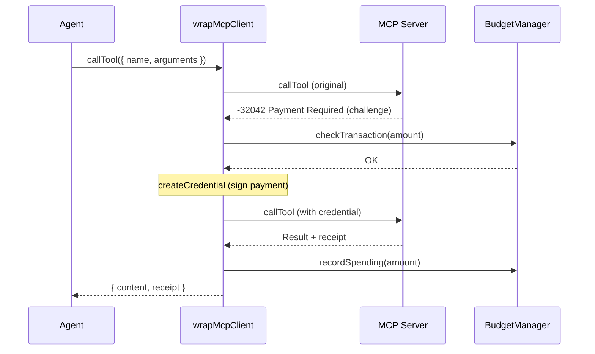

Some MCP servers require payment for tool calls, returning error code `-32042` (Payment Required). `wrapMcpClient()` wraps a standard MCP Client to handle these payments automatically — detect the challenge, check budget, create credentials, and retry the call.

<Note>
  This is for **outgoing** payments to third-party MCP servers. It is separate from `@boltzpay/mcp`, which is BoltzPay's own MCP server that exposes tools to Claude Desktop.
</Note>

## Setup

```typescript
import { BoltzPay } from "@boltzpay/sdk";
import { Client } from "@modelcontextprotocol/sdk/client/index.js";
import { StdioClientTransport } from "@modelcontextprotocol/sdk/client/stdio.js";

// 1. Create and connect the MCP client
const transport = new StdioClientTransport({
  command: "npx",
  args: ["-y", "some-paid-mcp-server"],
});
const mcpClient = new Client({ name: "my-agent", version: "1.0" });
await mcpClient.connect(transport);

// 2. Create BoltzPay with an MPP wallet
const agent = new BoltzPay({
  wallets: [{
    type: "tempo",
    name: "main",
    tempoPrivateKey: process.env.TEMPO_PRIVATE_KEY!,
  }],
  budget: { daily: "5.00", perTransaction: "1.00" },
});

// 3. Wrap the client
const wrapped = agent.wrapMcpClient(mcpClient);

// 4. Call tools — payments happen automatically
const result = await wrapped.callTool({
  name: "expensive_tool",
  arguments: { query: "latest data" },
});

console.log(result.content);
```

## How It Works



1. The wrapper calls the MCP server normally.
2. If the server returns `-32042`, the wrapper extracts the payment challenge.
3. Before creating credentials, the wrapper checks the configured budget limits.
4. If budget allows, it signs the payment using the configured MPP wallet method.
5. The call is retried with the payment credential attached.
6. On success, spending is recorded and the receipt is returned.

## Response Format

```typescript
interface WrappedCallToolResult {
  content: unknown;               // Tool result content
  isError?: boolean;              // Whether the tool returned an error
  _meta?: Record<string, unknown>; // Filtered metadata (safe keys only)
  receipt?: McpPaymentReceipt;    // Payment receipt (if payment was made)
}

interface McpPaymentReceipt {
  method: string;     // e.g. "tempo", "stripe"
  status: string;     // Payment status
  reference: string;  // Transaction reference
  timestamp: string;  // ISO timestamp
}
```

If no payment was required, `receipt` is `undefined`.

## Budget Enforcement

Budget checks happen **before** credential creation, not after. If the payment amount would exceed any configured limit, a `BudgetExceededError` is thrown and the MCP call fails without making a payment.

```typescript
import { BudgetExceededError } from "@boltzpay/sdk";

try {
  await wrapped.callTool({ name: "expensive_tool" });
} catch (err) {
  if (err instanceof BudgetExceededError) {
    console.log(`Blocked: ${err.code}`);
    // "daily_budget_exceeded" | "monthly_budget_exceeded" | "per_transaction_exceeded"
  }
}
```

## Events

MCP payments emit a dedicated event:

```typescript
agent.on("mcp:payment", (event) => {
  console.log(`Tool: ${event.toolName}`);
  console.log(`Amount: ${event.amount.toDisplayString()}`);
  console.log(`Receipt: ${JSON.stringify(event.receipt)}`);
});
```

Each payment is also recorded in payment history with `transport: "mcp"`:

```typescript
const history = agent.getHistory();
const mcpPayments = history.filter((r) => r.transport === "mcp");
```

## Requirements

- At least one MPP wallet must be configured (`tempo` or `stripe-mpp`). `wrapMcpClient()` throws `ConfigurationError` if no MPP wallet is available.
- The MCP client must implement `callTool()` (standard `@modelcontextprotocol/sdk` Client).
- Budget is optional but recommended for autonomous agents.

## Security

- The wrapper filters `_meta` fields using an allowlist. Only the payment receipt key (`org.paymentauth/receipt`) is passed through. All other `_meta` fields from the MCP server response are stripped.
- Payment amounts are validated as non-negative integers before processing.

## Next Steps

- [Sessions](/concepts/sessions) -- streaming payments via payment channels
- [Budget & Safety](/concepts/budget-safety#mcp-budget-enforcement) -- budget enforcement details
- [Configuration](/getting-started/configuration#wallets) -- wallet setup
